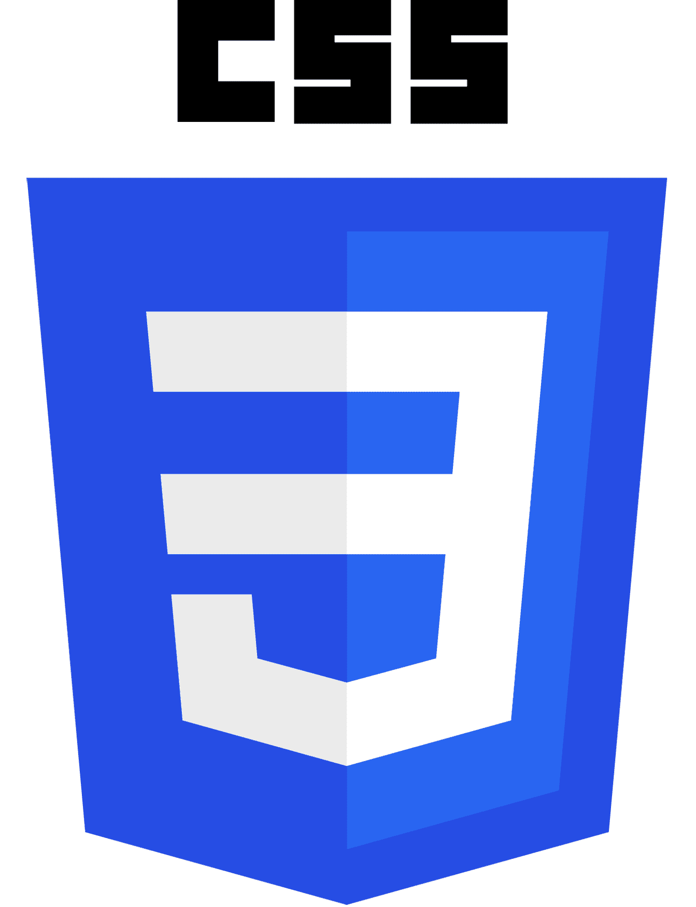
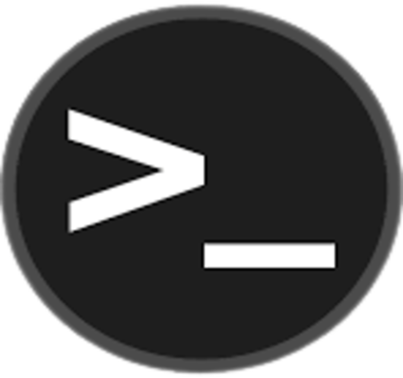

## Hi there, I'm Arif Nur Rizqi 👋

### I'm a Student

- 👀 I’m interested in embeded system and web development
- 🌱 I’m currently learning Internet of Things and Backend development
- 💞️ I’m looking to collaborate with other people
- 🥅 2024 Goals:
  * Contribute more to Open Source projects
  * Completed the project last year
  * Get an internship
  * Take part in PIMNAS 2024
  * Start working on the final assignment
- ⚡ Fun fact: i love april ♥

### Connect with me:

[][website]
[][youtube]
[][twitter]
[][instagram]

 

### Languages and Tools:

 

 
<!---

--->

[website]: https://aarrnnuurr.netlify.app/error.html
[twitter]: https://twitter.com/arifnurrizqi
[youtube]: https://www.youtube.com/channel/UCArjaHdj-UV9FQZNL_aZgRg
[instagram]: https://instagram.com/arifnur.rizqi
<!---
arifnurrizqi/arifnurrizqi is a ✨ special ✨ repository because its `README.md` (this file) appears on your GitHub profile.
You can click the Preview link to take a look at your changes.
--->
